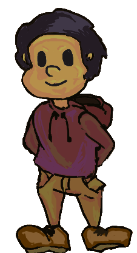

# Zelon
 
 

  

  <h1 align="center">Zelon</h1>

  

    A Maze Runner Game
     
  

  
Table of Contents

  <ol>
    <li>
      <a href="#about-the-project">About The Project</a>
      <ul>
        <li><a href="#built-with">Built With</a></li>
      </ul>
    </li>
    <li>
      <a href="#getting-started">Getting Started</a>
      <ul>
        <li><a href="#prerequisites">Prerequisites</a></li>
        <li><a href="#installation">Installation</a></li>
      </ul>
    </li>
    <li><a href="#usage">Usage</a></li>
    <li><a href="#roadmap">Roadmap</a></li>
    <li><a href="#contributing">Contributing</a></li>
    <li><a href="#license">License</a></li>
    <li><a href="#contact">Contact</a></li>
    <li><a href="#acknowledgements">Acknowledgements</a></li>
  </ol>

## About The Project
This project initially was meant to be a game that offers the player a maze that they have to navigate through in dim lighting, while avoiding enemies with their own behavior trees. however i had to make changes and instead implemented a perlin noise background on the title screen. here is the video with the gameplay.
<a href="#built-with>https://youtu.be/tnhgFXnAku0</a></li>https://youtu.be/tnhgFXnAku0
